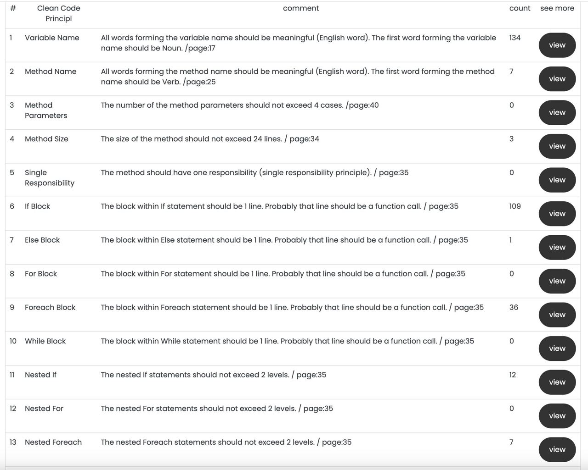
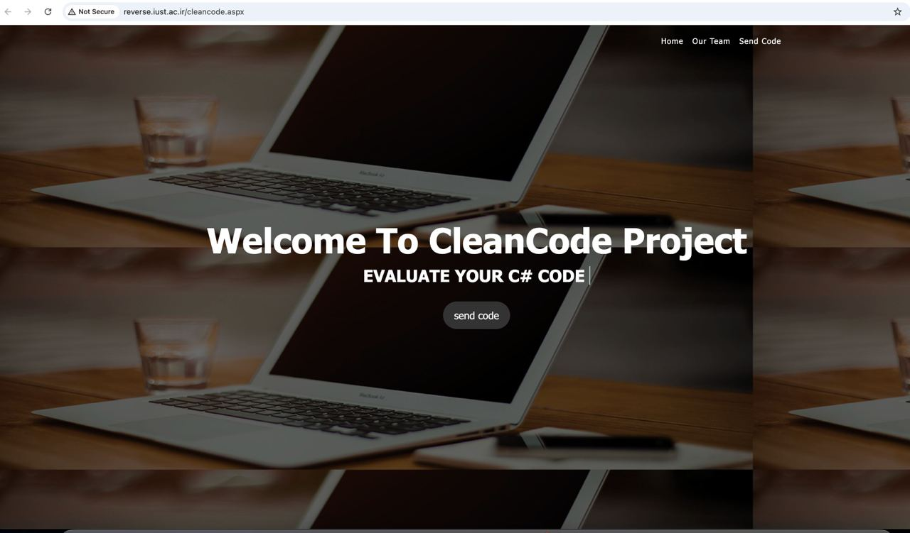

# Clean Code Checker

## ⚠️ Notice

This repository contains two codebases: one for Windows Forms (C#) and another for a web-based Clean Code Checker. 

The original project dates back to 2020 and is no longer maintained. Feel free to build upon our ideas to create a more enhanced Clean Code Checker.

## 📖 Description

Based on Robert Martin’s *Clean Code* book, this checker evaluates C# code against 14 rules and counts their violations. These rules help developers write cleaner, more maintainable code.

  
*Figure 1: Summary of Clean Code Rules*

## 🌍 Website Support

I hope my previous university, **IUST**, still maintains this domain for us. Feel free to use it, but note that it is best suited for less complex C# code:

🔗 [Website URL](http://reverse.iust.ac.ir/cleancode.aspx)

---

  
*Figure 2: Website Interface*
